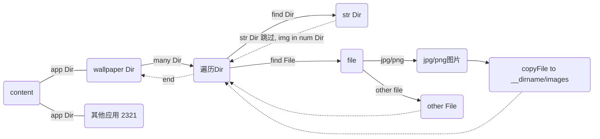

# 使用说明

可以将 wallpaper 本地图片资源统一提取至 steam\steamapps\workshop\content\image 下<br />

需要提前将 get-image.cjs 拷贝至 workshop\content\wallpaper（名字是数字）目录下<br />
也可以直接放在 content 目录，这样还可以拿到其他应用的浅层 jpg/png 文件



## 安装

```
git clone https://github.com/1099571219/wallpaper-img-fetch.git
```

## 执行

先将脚本移动到 wallpaper 本地资源路径下再在当前路径下运行，（需要打开 wallpaper 查看本地资源路径） 或 steam\steamapps\workshop\content\

```
node ./get-image.cjs
```
